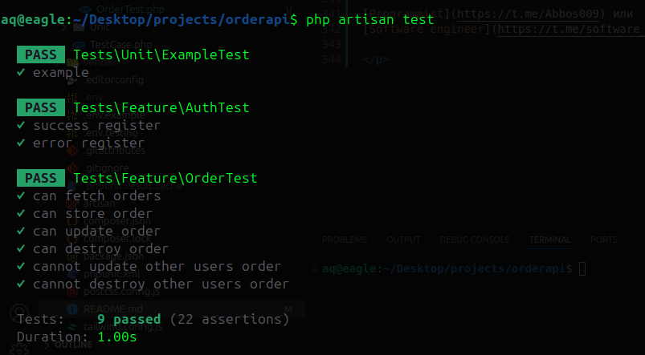

# Order Processing Mini-Service

## Описание

Данный сервис реализован на Laravel и предназначен для обработки заказов. Он предоставляет REST API для создания, получения и обновления заказов. Также реализована функциональность отправки уведомлений пользователю при создании заказа (уведомление записывается в лог).

---

## Установка и запуск

### Системные требования

-   PHP >= 8.2
-   Composer
-   MySQL (или любая другая поддерживаемая база данных)
-   Laravel >= 11.x

### Установка

1. Клонируйте репозиторий:

    ```bash
    git clone https://github.com/abbosbey2002/Order-miroservice
    cd Order-miroservice

    ```

2. Установите зависимости:
    ```bash
    composer install
    ```
3. Скопируйте файл .env.example в .env и настройте параметры подключения к базе данных:
    ```bash
    cp .env.example .env
    ```
4. Генерируйте ключ приложения:
    ```bash
    php artisan key:generate
    ```
5. Подключить базу данных через .env file:

    ```bash
    DB_CONNECTION=База данных: например mysql
    DB_HOST=127.0.0.1
    DB_PORT=3306
    DB_DATABASE=имя базы данных
    DB_USERNAME=Имя пользователя базы данных
    DB_PASSWORD=Пароль базы данных

    QUEUE_CONNECTION=database
    ```

# Использование

### Запуск сервиса

1. Для запуска локального сервера используйте команду:
    ```bash
    php artisan serve
    ```
2. Для работы с очередями на основе драйвера database необходимо запустить миграцию:

    ```bash
    php artisan queue:table
    php artisan migrate

    ```

3. Запустите обработчик очередей:
    ```bash
    php artisan queue:work
    ```

# API-эндпоинты

## API-эндпоинты для аутентификации

В проекте реализована аутентификация пользователей с использованием Sanctum. Пользователи могут регистрироваться, входить в систему, выходить из системы, а также завершать сессии на всех устройствах.

---

### 1. Регистрация пользователя

**POST /api/register**

Регистрирует нового пользователя.

**Тело запроса:**

```json
{
    "name": "John Doe",
    "email": "john@example.com",
    "password": "password123",
    "password_confirmation": "password123"
}
```

Ответ:

```json
{
    "access_token": "Bearer token",
    "token_type": "Bearer"
}
```

### 2. Логин пользователя

**POST /api/login**

Регистрирует нового пользователя.

**Тело запроса:**

```json
{
    "email": "john@example.com",
    "password": "password123"
}
```

Ответ:

```json
{
    "access_token": "Bearer token",
    "token_type": "Bearer"
}
```

### 3. Логаут пользователя

**POST /api/logout**

Завершает текущую сессию пользователя. Требует токен аутентификации.

    curl -X POST http://127.0.0.1:8000/api/logout \
    -H "Authorization: Bearer <access_token>"

Ответ:

```json
{
    "message": "Successfully logged out"
}
```

### 4. Логаут со всех устройств

**POST /api/logoutdevices**

Регистрирует нового пользователя.

Пример запроса:

    curl -X POST http://127.0.0.1:8000/api/logoutdevices \
    -H "Authorization: Bearer <access_token>"

Ответ:

```json
{
    "message": "Successfully logged out from all devices"
}
```

## API-эндпоинты для заказов

### 1. Получение списка заказов

**GET /api/orders**

Возвращает список заказов текущего пользователя. Можно фильтровать заказы по статусу.

**Параметры запроса:**

-   `status` (необязательно) — фильтрация по статусу заказа (`pending`, `processed`, `shipped`).

**Пример запроса:**

    ```bash
    curl -X GET http://127.0.0.1:8000/api/orders
    -H "Authorization: Bearer <access_token>"

**Пример с фильтром:**

    curl -X GET "http://127.0.0.1:8000/api/orders?status=processed" \
    -H "Authorization: Bearer <access_token>"

Ответ:

```json
{
    "orders": [
        {
            "id": 1,
            "user_email": "user@example.com",
            "product_name": "Sample Product",
            "price": 50.0,
            "status": "processed",
            "created_at": "2024-12-01T10:00:00.000000Z",
            "updated_at": "2024-12-01T11:00:00.000000Z"
        }
    ]
}
```

### 2. Создание заказа

**POST /api/orders**

Создаёт новый заказ для текущего пользователя.

**Тело запроса::**

```json
{
    "product_name": "Sample Product",
    "price": 50.0,
    "status": "pending"
}
```

Пример запроса:

    curl -X POST http://127.0.0.1:8000/api/orders \
    -H "Authorization: Bearer <access_token>" \
    -H "Content-Type: application/json" \
    -d '{
    "product_name": "Sample Product",
    "price": 50.00,
    "status": "pending"
    }'

Ответ:

```json
{
    "id": 1,
    "user_email": "user@example.com",
    "product_name": "Sample Product",
    "price": 50.0,
    "status": "pending",
    "created_at": "2024-12-01T10:00:00.000000Z",
    "updated_at": "2024-12-01T10:00:00.000000Z"
}
```

### 3. Обновление заказа

**PUT /api/orders/{id}**

Обновляет данные существующего заказа, принадлежащего текущему пользователю.

**Тело запроса::**

```json
{
    "product_name": "Updated Product",
    "price": 60.0,
    "status": "processed"
}
```

Пример запроса:

    curl -X PUT http://127.0.0.1:8000/api/orders/1 \
    -H "Authorization: Bearer <access_token>" \
    -H "Content-Type: application/json" \
    -d '{
    "product_name": "Updated Product",
    "price": 60.00,
    "status": "processed"
    }'

Ответ:

```json
{
  "id": 1,
  "user_email": "user@example.com",
  "product_name": "Updated Product",
  "price": 60.00,
  "status": "processed",
  "created_at": "2024-12-01T10:00:00.000000Z",
  "updated_at": "2024-12-01T11:00:00.000000Z"
}
```


### 4. Удаление заказа

**DELETE /api/orders/{id}**

Удаляет существующий заказ, принадлежащий текущему пользователю.


Пример запроса:

    curl -X DELETE http://127.0.0.1:8000/api/orders/1 \
    -H "Authorization: Bearer <access_token>"

Ответ:

```json
{
  "message": "Order deleted successfully."
}
```

Если заказ не найден:

```json
{
   "message": "Order not found!"
}
```

Если заказ не принадлежит текущему пользователю:
```json
{
  "message": "This order does not belong to you."
}
```


# Тестирование проекта

Этот проект проверяет, что основные функции работают корректно. Если возникнут ошибки, обязательно свяжитесь с разработчиком для их устранения.
---

Тестовая команда:

    php artisan test


<p>

[Programmist](https://t.me/Abbos009) или
[Software engineer](https://t.me/software_engineer5)

</p>